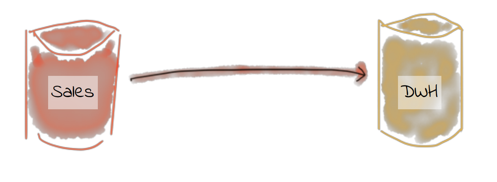
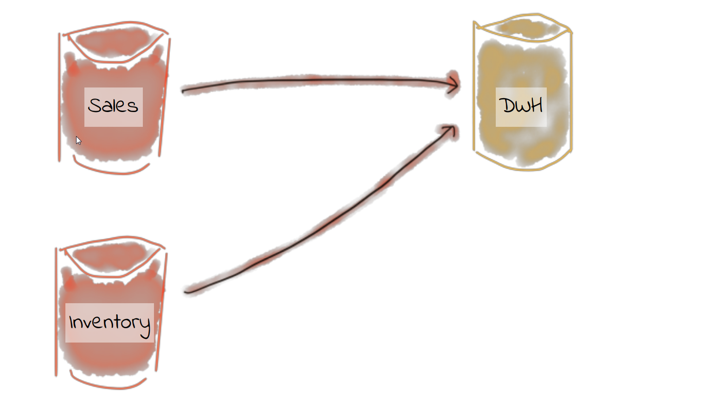
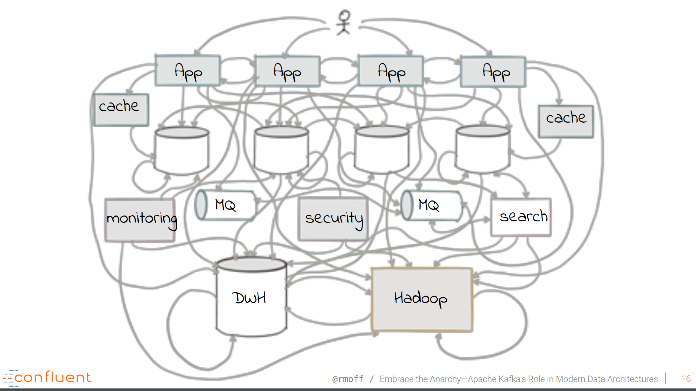
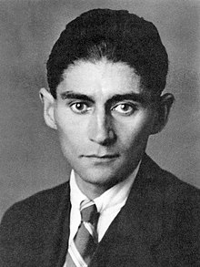
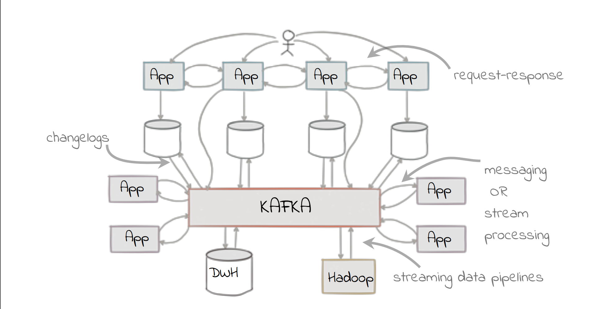

---
@title[Apache Kafka]

# Apache Kafka

---
@title[Overview]
### Overview
* Why Kafka
* What is Kafka
* Technical View
* Kafka and Openshift
* Possible Solutions
* DEMO

---

@title[Why Kafka]

### How everything started ...

+++
### We want more datasources

+++

### Where we ended

+++

### There was a guy ...

+++

### Possible Solution

---
@title[How does it work]

### Concepts

* Events
* Streaming
* Event-Driven Development

+++

### Events in everyday life

* Change Address - Move
* Marriage
* Get your driving license
* Start a new work

---

# Thanks - QA?

---

### Sources
* [Confluent](https://www.confluent.io/)
* [4-Years of GraphQL](https://kafka.apache.org/)
* [GraphQL under the hood](https://about.sourcegraph.com/graphql/graphql-under-the-hood)
* [Eric-Baer-GraphQL under the hood](https://www.youtube.com/watch?v=fo6X91t3O2I)
* [graphql-java](https://github.com/graphql-java/graphql-java)
* [data-loader](https://medium.com/@gajus/using-dataloader-to-batch-requests-c345f4b23433)

