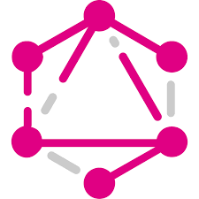
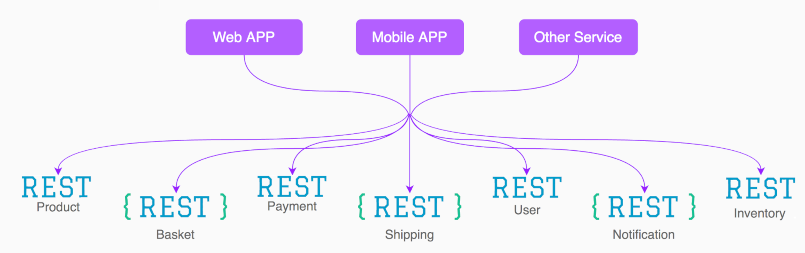
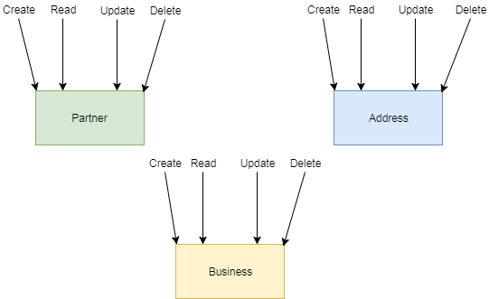
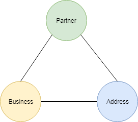
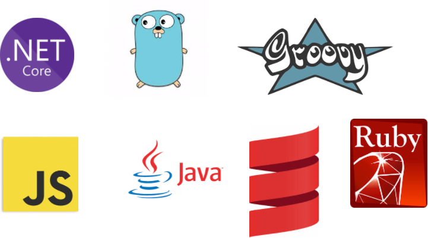

---
@title[GraphQL]

# GraphQL



---
@title[Overview]
### Overview
* Why GraphQL
* How does it work
* API-Design concepts
* How to start
* DEMO

---
@title[Why GraphQL]

### Facebook 2012


+++
@title[Facebook Services]

@snap[north]
<h4>Facebook Services</h4>
@snapend



@snap[south-west]
@ul
- Graph of objects
- Many Endpoints
@ulend
@snapend

@snap[south-east]
@ul
- Overfetching
- Fixed json models
@ulend
@snapend


+++

@title[GraphQL]
@snap[north]
<h4>Solution</h4>
@snapend


@snap[south-west sidebar]
@ul
- Single API Endpoint
- GraphQL as Query-Language
@ulend
@snapend

@snap[south-east sidebar]
@ul
- Query a graph of objects
- Select properties
@ulend
@snapend

---
@title[How does it work]

### Concepts

* Query
* Mutation

+++
@title[Query]
### Query
+++
@title[Query]

Simple hero query


```
{
  hero {
    name
    # Queries can have comments!
    friends {
      name
    }
  }
}
```
```
{
  "data": {
    "hero": {
      "name": "R2-D2",
      "friends": [
        {
          "name": "Luke Skywalker"
        }
      ]
    }
  }
}
```
+++
@title[Parameter]
### Parameters

```
{
  hero(episode: EMPIRE) {
    name
  }
}
```
+++
@title[Alias]
### Alias

```
{
  empireHero: hero(episode: EMPIRE) {
    name
  }
  jediHero: hero(episode:JEDI){
    name
  }
  other: hero(episode:OTHER){
     name
  }
}
```
+++
@title[Mutation]
### Mutation

+++
@title[MutQuery]

Simple mutation


```
mutation CreateReviewForEpisode($ep: Episode!, $review: ReviewInput!) {
  createReview(episode: $ep, review: $review) {
    stars
    commentary
  }
}
```
```
{
  "data": {
    "createReview": {
      "stars": 5,
      "commentary": "This is a great movie!"
    }
  }
}
```
+++
@title[How does it work]

### Mutation

* CUD operations
* Multiple Mutations in one operation possible
* Query your desirable return value

---
@title[Best practices]

### API-Design Concepts

* Think in Graphs
* Shared Language

+++
@title[Implementation]

### Think in Graphs

* With GraphQL, you model your business domain as a graph
* Query your Business Objects
* Which relation does my client need?
* It is not the same as Database relation

+++
@title[Implementation]

### Rest Thinking



+++
@title[Implementation]

### GraphQL Thinking



+++
@title[Implementation]

### Shared Language

* Refer to DDD use Ubiquitous Language
* To build a good schema you need clear business descriptions
* Shared understanding and consensus of business in team

---
@title[Java implementation]

### How to start

* Design your schema
* Choose your Languages

+++
@title[Java implementation]

### Design your schema

+++
@title[Java implementation]

### Schema Type-definition

```
type Partner{
  id: Int
  name: String
  firstName: String
  gebDate: LocalDate
  sex: Int
}
```
+++
@title[Java implementation]

### Schema Query + Mutation + Schema

```
type Query {
  getPartner(id: Int):Partner
}
type Mutation {
  createPartner(id: Int!, name: String!, firstName: String!): Partner
  deletePartner(id: Int!): Partner
}
schema {
  query: Query
  mutation: Mutation
}
```
+++
@title[Implementation]

### Schema

* Language independent
* Service definition similar wsdl
* Generates typesafety

+++
@title[Java implementation]

### Supported languages



---
@title[DEMO]

### “Talk is cheap. Show me the code.”
Linus Torvalds

---

# Thanks - QA?

---

### Sources
* [Graphql Github](https://graphql.github.io/)
* [4-Years of GraphQL](https://www.graphql.com/articles/4-years-of-graphql-lee-byron)
* [GraphQL under the hood](https://about.sourcegraph.com/graphql/graphql-under-the-hood)
* [Eric-Baer-GraphQL under the hood](https://www.youtube.com/watch?v=fo6X91t3O2I)
* [graphql-java](https://github.com/graphql-java/graphql-java)
* [data-loader](https://medium.com/@gajus/using-dataloader-to-batch-requests-c345f4b23433)


