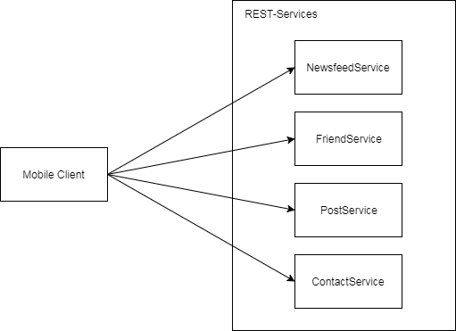
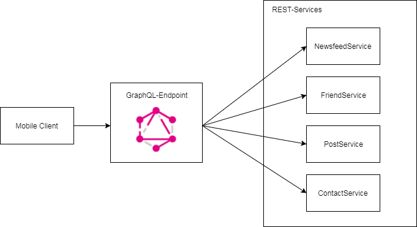

---
@title[GraphQL]

# GraphQL


---
@title[Overview]
### Overview
* Why GraphQL
* How does it work
* Java implementation

---
@title[Why GraphQL]

### Facebook 2012


+++
@title[Facebook Services]

@snap[north]
<h4>Facebook Services</h4>
@snapend

@snap[west]

@ul
- Slow performance due overfetching
- Fixed json models
- Graph of objects is needed
@ulend

@snapend

@snap[east]

@snapend


+++
@title[GraphQL API]

### Solution


* Single API Endpoint
* Query a graph, select properties

---
@title[How does it work]

### Concepts

* Query
* Mutation

+++
@title[Query]

@snap[north-east]

Simple hero query
@snapend

@snap[west]
```
{
  hero {
    name
    # Queries can have comments!
    friends {
      name
    }
  }
}
```
@snapend
@snap[east]
```
{
  "data": {
    "hero": {
      "name": "R2-D2",
      "friends": [
        {
          "name": "Luke Skywalker"
        },
        {
          "name": "Han Solo"
        },
        {
          "name": "Leia Organa"
        }
      ]
    }
  }
}
```
@snapend

---

# Thanks - QA?
