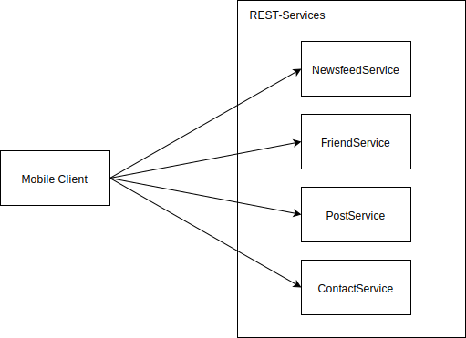
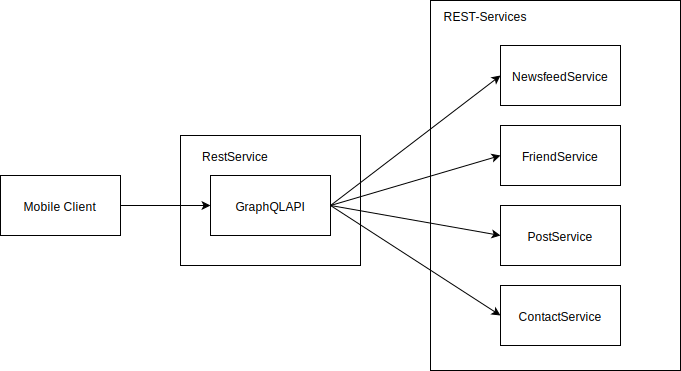

---
@title[GraphQL]

# GraphQL

---
@title[Overview]

* Why GraphQL
* How does it work
* Java implementation

---
@title[Why GraphQL]

### Facebook 2012

@title[Facebook Services]

### Facebook Services

* Slow performance due overfetching
* Rest endpoints deliver fixed json models
* Difference between server objects and mobile clients
* Need for a graph of objects

@title[GraphQL API]

### Solution

* Build a new API

---
@title[How does it work]

### Concepts

@title[]

---

# Thanks - QA?
