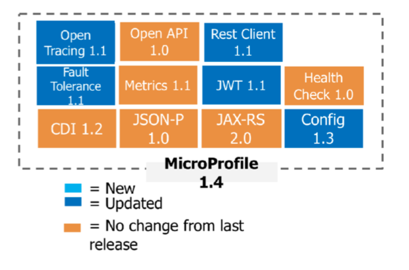
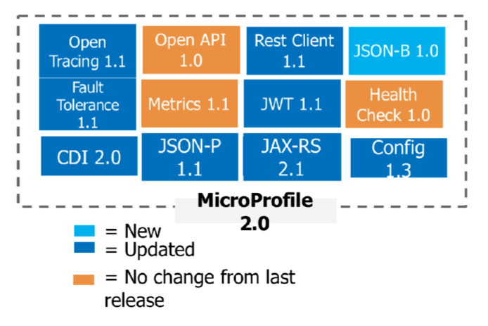
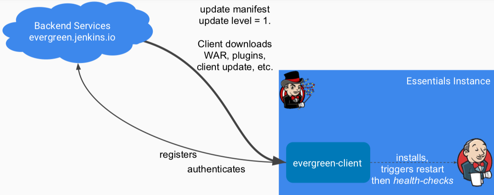
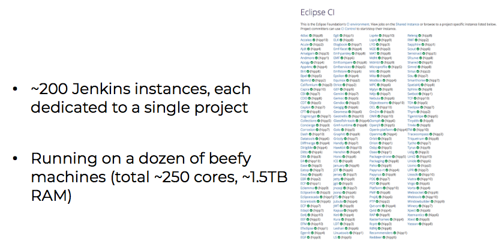

---
@title[EclipseCon France 2018]

# conference summary

---
@title[Overview]

### TOULOUSE, FRANCE · JUNE 12 - 14, 2018

#### Unconference - Community event

Workshop: Building Cloud and Desktop IDEs with Theia

Hands-on Cloud-Native Java with Eclipse MicroProfile Workshop

#### main conference

+++
@title[Cloud IDE Theia]

### Cloud IDE Theia

currently closed BEATA: gitpod.io

provision IDE + workspace with one [click](https://gitpod.io/#https://github.com/baloise/pitches/tree/eclipsecon-france-18)

+++?color=black
@title[Microprofile and OpenLiberty]

### Microprofile and OpenLiberty

Hands-on [Microprofile Guides](https://github.com/OpenLiberty?utf8=✓&q=guide-&type=&language=)

using IBMs WebSphere [OpenLiberty app server](https://github.com/OpenLiberty)

---

@title[Eclipse MicroProfile - What's new]

### [Eclipse MicroProfile - What's new](https://www.eclipsecon.org/france2018/sites/default/files/slides/Microprofile-New_and_Noteworthy.pdf)

+++

@title[Eclipse MicroProfile - 2.0]

### [Eclipse MicroProfile - 2.0](http://microprofile.io/projects)

---

@title[Eclipse Photon]

## [Eclipse Photon](https://www.eclipsecon.org/france2018/session/approaching-light-speed-news-eclipse-photon-platform)

### [Focus on IDE improvements](https://starwarsintrocreator.kassellabs.io/?ref=redirect#!/AL8nDXUfLt4EuoJ6tF-m)

---

@title[Evergreen Jenkins]

### [Evergreen Jenkins](https://www.eclipsecon.org/france2018/session/jenkins-essentials-evergreen-version-jenkins)

+++

@title[CI Infrastructure @ Eclipse]

### [CI Infrastructure @ Eclipse](https://www.eclipsecon.org/france2018/session/better-ci-infrastructure-eclipse-projects-or-how-manage-200-jenkins-masters)

+++

@title[CI Infrastructure @ Eclipse - 2]

## Eclipse Foundation CI is moving to a Kubernetes (OpenShift) cluster based solution + CloudBees Jenkins Enterprise 

Better scalability + better resilience

Little to no disruption expected

---?image=https://opensource.org/files/osi_symbol.png&size=contain&opacity=30

@title[Open Source: The Third Decade]

### [Open Source: The Third Decade](https://www.eclipsecon.org/france2018/sites/default/files/slides/1824-EclipseCon-Toulouse.pdf)

 Simon Phipps, president@opensource.org
