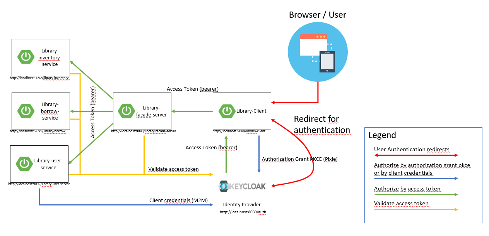

---
@title[OIDC]

## OAuth2 und OIDC 

Arthur Neudeck, Markus Lindenmann, Roland Seidel, Dane Leube

---
@title[Overview]
### Overview
* Why OAuth and OIDC?
* Example Domain
* OAuth2 and OIDC
* Live-Demo 

---

## Why OAuth and OIDC?

+++

### 10 years ago

+++

### Use Cases

* Simple login
* Single Sign-on accross multiple sites 
* Mobile app login
* Delegates authorization

---

## Example Domain

+++

## Library

* Manage books in one or more inventories
* Manage users for borrowed books
* Manage borrowed books

+++

### TechStack

---

## OAuth2 and OIDC

+++

## Authentication

Verifies you are who you say you are.

e.g. Username/Password, Login form

+++

## Authorization

Decides if you have permission to access a ressource

e.g. UserRoles, Access control lists (ACLs)

+++

### OAuth2

OAuth 2.0 is the industry-standard protocol for authorization. OAuth 2.0 focuses on client developer simplicity while providing specific authorization flows for web applications, desktop applications, mobile phones, and living room devices. IETF OAuth Working Group developed this specification and its extensions.

+++

### OAuth2 overview

+++

### OAuth2 code grant flow

+++

### When to use

* Untrusted clients
* Example: Single Page Applications (SPA)

+++

### OAuth2 client credentials

+++

### When to use

* Internal clients (if you have a secure channel)
* Example: internal server to server communication

+++

### OIDC

How do we publish user infos (e.g. E-Mail, username, etc.)? No standard way to get this information.
No common set of scopes

+++

### OAuth and OIDC

* OpenID Connect is for **authentication**

* OAuth 2.0 is for **authorization**

+++

@snap[west span-50]

@snapend

@snap[east span-50]
@ul
- ID token (added to jwt token)
- User Info Endpoint
- OpenID Provider Configuration Information
@ulend
@snapend

+++

### When to use

* For user authentication
* Example: Single Sign On (SSO)

---

## Live Demo
+++

## Library OIDC scenario

+++

## Use Case 1: Authorization Flow

* [WebSecurityConfiguration](https://github.com/bal-code-camp-rest-oidc/oidc-application-client/blob/2ace0b86d62f179677937f2ddc1c459c19404658/spring-application/library-client/src/main/java/com/example/library/client/config/WebSecurityConfiguration.java#L40)
* [WebClientConfiguration](https://github.com/bal-code-camp-rest-oidc/oidc-application-client/blob/2ace0b86d62f179677937f2ddc1c459c19404658/spring-application/library-client/src/main/java/com/example/library/client/config/WebClientConfiguration.java#L25)
* [Live-Demo](https://bvcc2020-library-frontend.apps.baloise.dev/library-client)
    * Login with bbanner -> borrow books
    * Logout
    * Login with pparker -> add new books 

+++

## Use Case 2: Login via Github

* Identity Provider: Login with Github
* Default-Role library_user allows to borrow books
* [OAuth2 App Configuration Link](https://github.com/organizations/bal-code-camp-rest-oidc/settings/applications)
* [Openshift Keycloak Secret-Link](https://console-openshift-console.apps.okd.baloise.dev/k8s/ns/okd4-sampleconfig/secrets/credential-library-keycloak)
    * [Keycloak-Console link](https://keycloak-okd4-sampleconfig.apps.okd.baloise.dev/auth/admin/master/console/#/realms/workshop) 
    * Clients -> Login-Flows, Rolemapping
    * Identity Provider with Github, User Federation with Ldap
    * Groups, Sessions, Events

    
+++

## Use Case 3: OIDC

* Show username after login
* [Source Code OIDC User](https://github.com/bal-code-camp-rest-oidc/oidc-application-client/blob/2ace0b86d62f179677937f2ddc1c459c19404658/spring-application/library-client/src/main/java/com/example/library/client/web/BooksController.java#L47)
* Passthrough on downstream requests
    * [Source Code Library Server webclient config](https://github.com/bal-code-camp-rest-oidc/oidc-application-client/blob/2ace0b86d62f179677937f2ddc1c459c19404658/spring-application/library-server/src/main/java/com/example/library/server/config/WebClientConfiguration.java#L11) 
    * [Source Code Downstream Request BorrowService](https://github.com/bal-code-camp-rest-oidc/oidc-application-client/blob/2ace0b86d62f179677937f2ddc1c459c19404658/spring-application/library-server/src/main/java/com/example/library/server/business/BookService.java#L213) 

+++

## Use Case 4: Client credentials

* Login with ckent
* UserService loggs in to keycloak with client credential flow
* Get UserDetails to show list of borrowed books
*  [Source Code Client credential flow](https://github.com/bal-code-camp-rest-oidc/oidc-application-client/blob/2ace0b86d62f179677937f2ddc1c459c19404658/spring-application/keycloak-client/src/main/java/ch/baloise/keycloak/client/admin/KeycloakAdminFacadeImpl.java#L54)

---

## Wrap Up

---

### Sources
* [OAuth 2.0 and OpenID Connect Video](https://www.youtube.com/watch?v=996OiexHze0)
* [OAuth 2.0 and OpenID Connect Slides](https://speakerdeck.com/nbarbettini/oauth-and-openid-connect-in-plain-english)
* [Security-Workshop](https://github.com/andifalk/secure-oauth2-oidc-workshop)
* [Security-Workshop slides](https://andifalk.github.io/oidc-workshop-spring-io-2019/#/)
* [LibraryImage](https://www.timeout.com/news/this-national-emergency-library-is-offering-free-online-access-to-1-4-million-books-042920)

+++

## Appendix

+++

### OAuth2 flows

* Authorization code
* Implicit (deprecated)
* Resource owner password credentials
* Client credentials

+++

### OAuth: What Flow To Choose?

(Source: https://developer.okta.com/docs/concepts/oauth-openid/)

