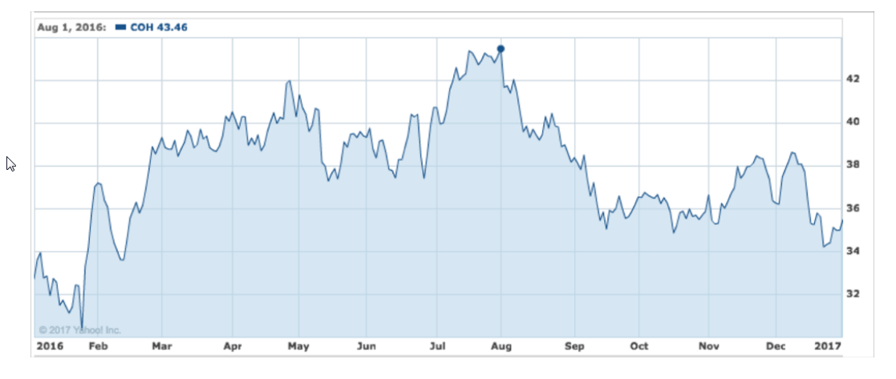
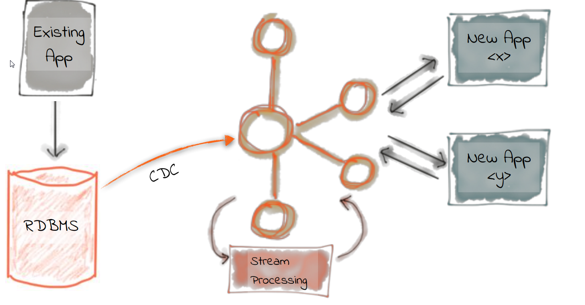

---
@title[Apache Kafka]

---
@title[Overview]
### Overview
* Why Kafka
* What is Kafka
* Technical View
* Deployment View
* Target Architectures
* DEMO

---
@title[Why Kafka]

# Why Kafka

+++

### How everything started ...

+++
### We want more datasources

+++

### Where we ended

+++

### There was a guy ...

+++

### Possible Solution

---
@title[How does it work]

### Concepts

* Events
* Streaming

+++

### Events in everyday life

* Change Address - Move
* Marriage
* Get your driving license
* Start a new work

+++

### An event is

* Notification
* State transfer

+++

### Events come in streams

+++

### Events describe what happened. 

### Sequences of events (streams) describe how it happened

+++

### Sequencing of moves is sometimes more important than end state

+++

### Stock price

---
@title[Kafka Components]

### Kafka components

* Components
* Log
* Connectors
* Stream processing

+++

### High level kafka

+++

### The distributed log

+++

### Idea of the log

* Kafka Topic

+++

### Consumer position

+++

### Connectors

+++

### Sink/Source Connectors

+++

### Input/Output to any data source

+++

### Stream processing

+++

### Stream processing

* Query continuous data
* Detect conditions within a small time period
* Detection time varies from milliseconds to minutes
* Alternative names: real-time analytics, streaming analytics or event processing

+++

### Stream processing with combine and summarize

+++

### KSQL

+++

### Windowed Aggregation

+++

### Java processing

---
@title[DeploymentView]

### Deployment View

* Kafka and zookeeper
* Strimzi

+++

### Apache Zookeeper

* Centralized service for distributed systems
* Provides ...
* ... distributed configuration service
* ... synchronization service
* ... naming registry

+++

### Role of zookeeper with kafka

+++

@snap[north]

@snapend

@snap[west sidebar]

@snapend

@snap[east sidebar]
@ul
- Open-Source- Kafka on Kubernetes
- Kafka as Kubernetes Resource
- Operator creates Kafka Cluster and Zookeeper
@ulend
@snapend

---
@title[Architectureal view]

### Architectural patterns

* Evolution of software systems
* Target architectures

+++

### Evolution of software systems

+++

### Evolution of software systems

+++

### Loosely coupled systems

+++

### Real-time Event  Enrichment

+++

### Evolve processing from old system to new

---

## Demo

### Monitoring Dashboard

https://fast-data-dev.demo.landoop.com/

### Parsys Demo

---

# Thanks - QA?

---

### Sources
* [Confluent](https://www.confluent.io/)
* [Kafka](https://kafka.apache.org/)
* [Strimzi](https://strimzi.io/)
* [The Future of Applications is Streaming](https://www.ittage.informatik-aktuell.de)
* [Embrace the Anarchy](https://www.ittage.informatik-aktuell.de)
* [Apache Kafka - Data Streaming und Messaging in einem](https://www.ittage.informatik-aktuell.de)

### Literature

