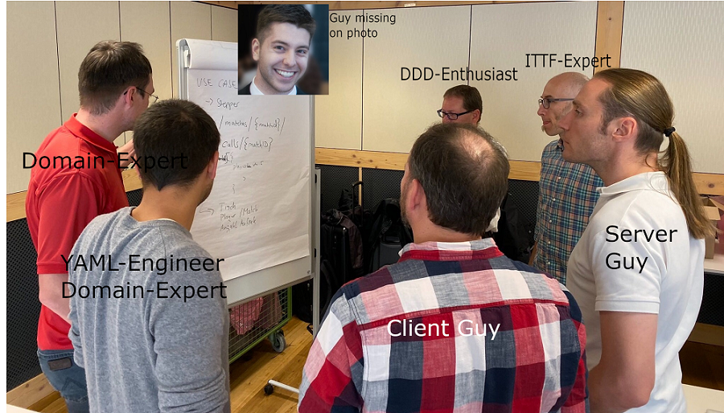
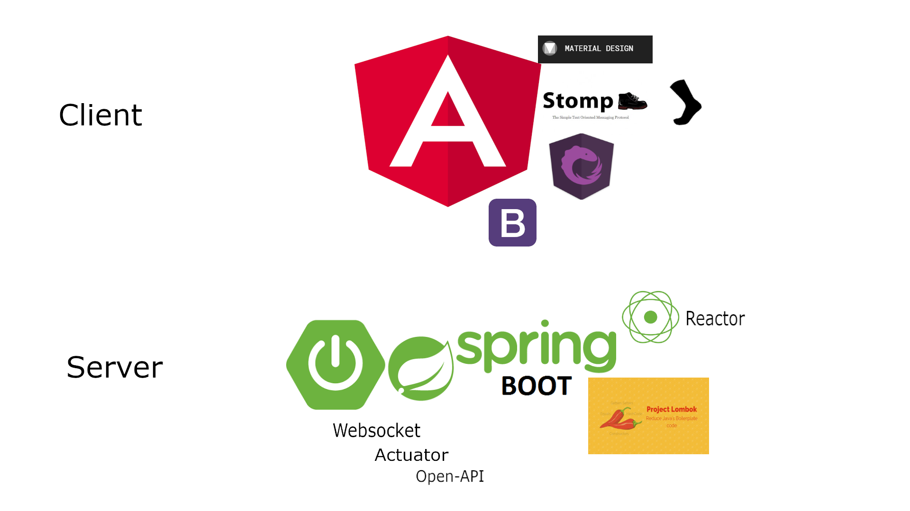
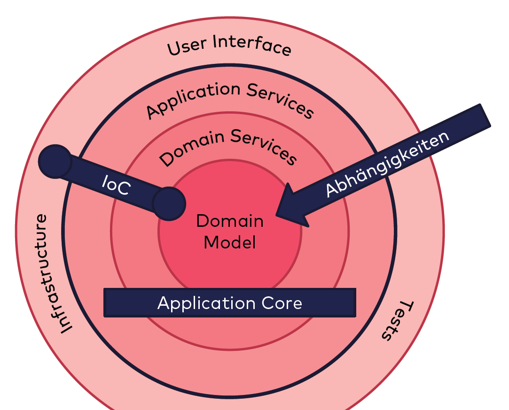

---
@title[DDD]

## Code-Camp DDD-Gruppe

---
@title[Overview]
### Overview
* Setup
* Execution
* Demo
* Q/A

---
# Setup

+++
@title[Domain]

### Table Tennis Tournament
[domain](https://www.youtube.com/watch?v=jkeUQ76uVx4)

+++
@title[Domain]

### Albgauturnier

+++
@title[Team]

### Team

---
# Execution

+++
@title[Why DDD]

### Whats the problem?

+++
@title[ContextMap]

### Context Map

+++
@title[Why DDD]

### Ubiquitous Language
* Table: A table tennis table
* Match: A single match between two opponents on a table
* Player: A table tennis player who is participating in a match
* Result: Multiple games and a result of a match
* Game: A single set in a match

+++
@title[stack]

### Technology Stack

+++
@title[onion]

### Onion Architecture

+++
@title[UL]
### Sophisticated Deployment Stack

---

# Demo

---

# Thanks - QA?

---

### Sources
* [ddd-principles](https://www.amazon.de/Patterns-Principles-Practices-Domain-Driven-Design/dp/1118714709/ref=sr_1_3?__mk_de_DE=%C3%85M%C3%85%C5%BD%C3%95%C3%91&keywords=ddd&qid=1568885147&s=books-intl-de&sr=1-3)
* [ddd-evans](https://www.amazon.de/Domain-Driven-Design-Tackling-Complexity-Software/dp/0321125215/ref=sr_1_2?__mk_de_DE=%C3%85M%C3%85%C5%BD%C3%95%C3%91&crid=2DBTY5TLDYZBC&keywords=tackling+complexity&qid=1568885072&s=books-intl-de&sprefix=tackling+compl%2Cenglish-books%2C166&sr=1-2)
* [ddd-distilled](https://www.amazon.de/Domain-Driven-Design-Distilled-Vaughn-Vernon/dp/0134434420)
* [bounded-contexts](https://martinfowler.com/bliki/BoundedContext.html)
* [context-mapping](https://stefan.kapferer.ch/2018/12/27/context-mapper-a-dsl-for-service-decomposition/)
* [tactical-design](https://thedomaindrivendesign.io/what-is-tactical-design/)
* [awesome-eventstorming](https://github.com/mariuszgil/awesome-eventstorming)
* [eventstorming-receipe](https://medium.com/@springdo/a-facilitators-recipe-for-event-storming-941dcb38db0d)

