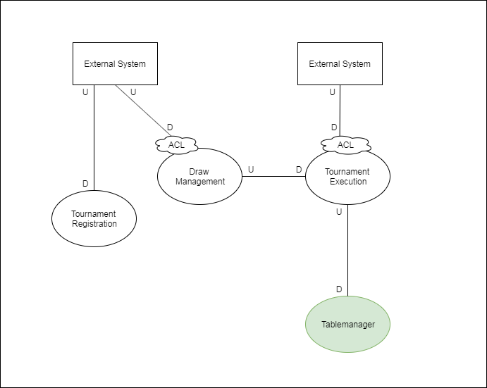

---
@title[DDD]

## Code-Camp DDD-Gruppe

---
@title[Overview]
### Overview
* Setup
* Progress
* Demo
* Q/A

---
@title[Domain]

### Table Tennis Tournament
[domain](https://www.youtube.com/watch?v=eGOgODy_itg)

+++
@title[Team]

### Team

+++
@title[Why DDD]

### Plan

+++
@title[ContextMap]

### Context Map

+++
@title[Why DDD]

### Whats the solution?

---
@title[How does it work]

### Overview

+++
@title[BC]

### Strategic Design

* Ubiquitous Language
* Bounded Context
* Context Map

+++
@title[UL]
### Ubiquitous Language
+++
### One Language for all

+++
### Use the language everywhere

+++
@title[UL_Bullet]
### Ubiquitous Language

* One common language between developer and domain expert
* Use same terms for same concept
* Both need the same knowledge about the domain

+++
@title[BC]

### BoundedContext

+++
### BoundedContext

* A space where the ubiquitous language is valid
* Deals with large models by dividing them into different Bounded Contexts
* Define clear boundaries
+++
@title[cmap]
### Context Map

+++
@title[cmapdef]

+++
@title[cmappoints]

### ContextMap

* Strategic Design big picture
* Define communication/relation between BoundedContexts
* Show dependencies between contexts
* Identify bottle-necks

+++

### Tactical Design

#### “The Tactical Design, is a set of technical resources used in the construction of your Domain Model, these resources must be applied to work in a single Bounded Context.”

---
### Event Storming

+++

### Event Storming

+++
@title[cmappoints]

### Event Storming

* Workshop-based method to quickly find out what is happening in the domain of a software
* Lightweight
* No support by a computer

+++

### Event Storming Notation

+++

### How to start?

* Use events only at the beginning 
* Try to focus on "Storming" at the beginning
* Add Actors next if it is needed
* Use read-models or screen layouts if you want to focus on UX 

---

# Thanks - QA?

---

### Sources
* [ddd-principles](https://www.amazon.de/Patterns-Principles-Practices-Domain-Driven-Design/dp/1118714709/ref=sr_1_3?__mk_de_DE=%C3%85M%C3%85%C5%BD%C3%95%C3%91&keywords=ddd&qid=1568885147&s=books-intl-de&sr=1-3)
* [ddd-evans](https://www.amazon.de/Domain-Driven-Design-Tackling-Complexity-Software/dp/0321125215/ref=sr_1_2?__mk_de_DE=%C3%85M%C3%85%C5%BD%C3%95%C3%91&crid=2DBTY5TLDYZBC&keywords=tackling+complexity&qid=1568885072&s=books-intl-de&sprefix=tackling+compl%2Cenglish-books%2C166&sr=1-2)
* [ddd-distilled](https://www.amazon.de/Domain-Driven-Design-Distilled-Vaughn-Vernon/dp/0134434420)
* [bounded-contexts](https://martinfowler.com/bliki/BoundedContext.html)
* [context-mapping](https://stefan.kapferer.ch/2018/12/27/context-mapper-a-dsl-for-service-decomposition/)
* [tactical-design](https://thedomaindrivendesign.io/what-is-tactical-design/)
* [awesome-eventstorming](https://github.com/mariuszgil/awesome-eventstorming)
* [eventstorming-receipe](https://medium.com/@springdo/a-facilitators-recipe-for-event-storming-941dcb38db0d)

