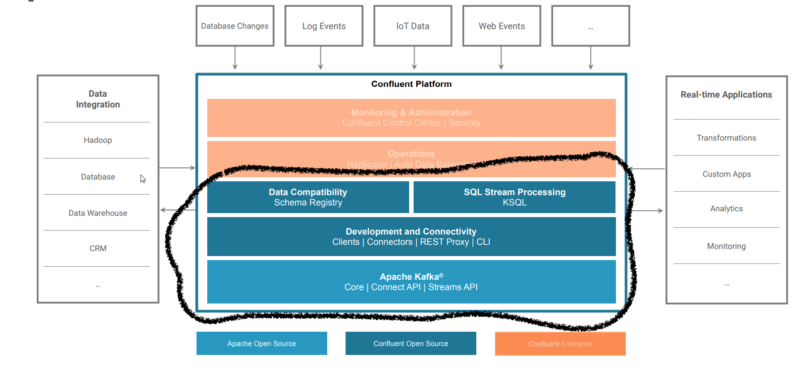

---
@title[Apache Kafka]

---
@title[Overview]
### Overview
* Why Kafka
* What is Kafka
* Technical View
* Deployment View
* Target Architectures
* DEMO

---

@title[Why Kafka]

### How everything started ...

+++
### We want more datasources

+++

### Where we ended

+++

### There was a guy ...

+++

### Possible Solution

---
@title[How does it work]

### Concepts

* Events
* Streaming
* Event-Driven Development

+++

### Events in everyday life

* Change Address - Move
* Marriage
* Get your driving license
* Start a new work

+++

### An event is

* Notification
* State transfer

+++

### Events come in streams

+++

### Stream processing with combine and summarize

+++

### Events describe what happened. 

### Sequences of events (streams) describe how it happened

---
@title[Kafka Components]

### Kafka components

* Components
* Log
* Connectors
* Stream processing

+++

### High level kafka

+++

### The distributed log

+++

### Idea of the log

+++

### Consumer position

+++

### Connectors

+++

### Input/Output to any data source

+++

### Stream processing

+++

### KSQL

+++

### Java processing

---
@title[DeploymentView]

### Deployment View

* Kafka and zookeeper
* Strimzi

+++

### Apache Zookeeper

* Centralized service for distributed systems
* Provides distributed configuration service
* Provides synchronization service
* Provides naming registry

+++

### Role of zookeeper with kafka

+++

@snap[north]

@snapend

@snap[west sidebar]

@snapend

@snap[east sidebar]
@ul
- Open-Source running Kafka on Kubernetes
- Kafka as Kubernetes Resource
- Operator creates Kafka Cluster and Zookeeper
@ulend
@snapend

---
@title[Architectureal view]

### Architectural patterns

* Evolution of software systems
* Target architectures

+++

### Evolution of software systems

+++

### Evolution of software systems

+++

### Target Architecture

+++

### Confluent platform

---

## Demo

### Monitoring Dashboard

https://fast-data-dev.demo.landoop.com/

---

# Thanks - QA?

---

### Sources
* [Confluent](https://www.confluent.io/)
* [4-Years of GraphQL](https://kafka.apache.org/)
* [GraphQL under the hood](https://about.sourcegraph.com/graphql/graphql-under-the-hood)
* [Eric-Baer-GraphQL under the hood](https://www.youtube.com/watch?v=fo6X91t3O2I)
* [graphql-java](https://github.com/graphql-java/graphql-java)
* [data-loader](https://medium.com/@gajus/using-dataloader-to-batch-requests-c345f4b23433)

